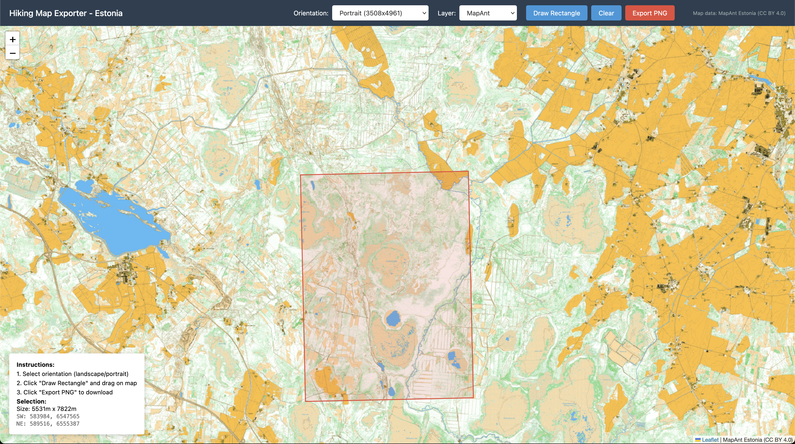

# Hiking Map Exporter - Estonia

A web tool for exporting high-resolution printable maps of Estonia. Select an area on the map and export it as a print-ready A3 image (300 DPI).



## Features

- **Two map layers**: MapAnt orienteering map and Maa-amet orthophoto
- **Print-ready output**: A3 at 300 DPI (4961×3508 or 3508×4961 pixels)
- **Orientation toggle**: Landscape or portrait
- **Aspect ratio lock**: Selection rectangle maintains A3 proportions
- **Max area limit**: 20km per side to ensure detail quality

## Quick Start

```bash
# Clone the repository
git clone https://github.com/yourusername/mapant.git
cd mapant

# Create virtual environment
python3 -m venv venv
source venv/bin/activate

# Install dependencies
pip install -r requirements.txt

# Run the server
python app.py
```

Open http://127.0.0.1:5000 in your browser.

## Usage

1. Select **orientation** (landscape/portrait)
2. Select **layer** (MapAnt or Orthophoto)
3. Click **Draw Rectangle** and drag on the map to select an area
4. Click **Export PNG** to download the high-resolution image

## Tech Stack

- **Backend**: Python, Flask, Pillow, pyproj
- **Frontend**: Leaflet.js, Proj4Leaflet
- **Coordinate System**: EPSG:3301 (Estonian Coordinate System)

## Map Data Sources

- **MapAnt Estonia**: Orienteering map ([CC BY 4.0](https://creativecommons.org/licenses/by/4.0/))
- **Maa-amet**: Estonian Land Board orthophoto

## License

MIT
